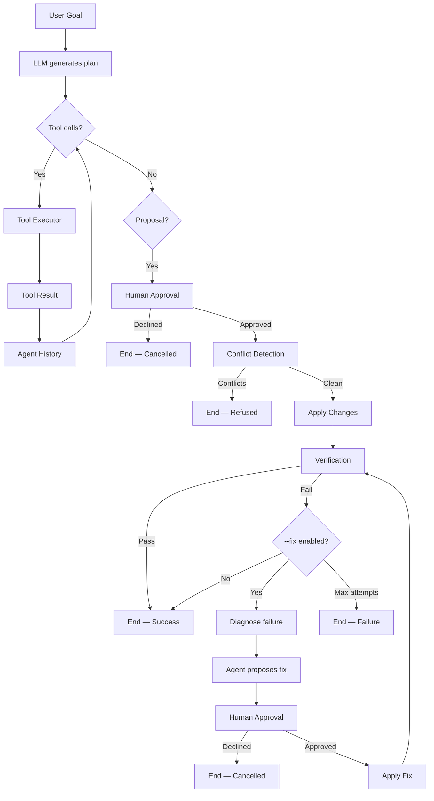

# DeCode

**Your Project, Decoded.**

DeCode is an AI-powered developer productivity CLI that understands your codebase, inspects files and Git state, executes a tightly controlled set of development commands, proposes code changes for human approval, verifies those changes, and can optionally perform a bounded auto-fix loop — all from the terminal.

Built for **Deploy or Die: HowToAlgo x GDGoC KIIT Hackathon** (Track B — Developer Productivity Tools).

---

## 🚀 What is DeCode?

DeCode is a terminal-first developer productivity platform that combines:

- **AI project intelligence** — read-only analysis of your codebase
- **AI coding agent** — natural-language goals with controlled, approval-gated code changes
- **API intelligence** — auto-detected route discovery and health checks
- **GitHub intelligence** — activity analysis and AI-generated narratives
- **Documentation tooling** — generate and freshness-check project docs
- **Project Q&A** — ask questions about your codebase without modifying anything
- **Verification** — run tests after changes to catch regressions
- **Bounded auto-fix** — controlled recovery from verification failures
- **Persistent sessions** — save and resume agent conversations

It solves the problem of context-switching between editors, terminals, Git, tests, and documentation by bringing those workflows into one controlled AI-powered CLI.

---

## 🎯 The Problem

Modern development requires jumping between many tools:

- Editors for code changes
- Terminals for running commands
- Git for history and diffs
- Test runners for verification
- Documentation tools for docs
- GitHub for activity and PRs

AI coding assistants exist, but unrestricted AI access to a codebase is dangerous:

- They can write code without review
- They can execute arbitrary commands
- They can modify files outside the project
- Changes aren't verified before being committed
- Failures require manual, unbounded recovery

Developers need **visibility**, **control**, and **verification** — not just automation.

---

## 💡 The DeCode Approach

DeCode is designed around six principles:

1. **Terminal-first** — works in CI, scripts, and interactive shells
2. **Project-aware** — understands your file tree, dependencies, and Git state
3. **Tool-driven** — every action goes through validated, permissioned tools
4. **Human-approved** — no disk write happens without explicit confirmation
5. **Verification-aware** — changes are validated with real commands
6. **Bounded** — iteration limits, retry limits, output truncation, and fix-attempt caps keep execution predictable

---

## 🔥 Feature Overview

### AI Agent (`decode agent`)

| Feature | Status |
|---|---|
| Natural-language coding goals | ✅ Implemented |
| Multi-tool orchestration | ✅ Implemented |
| Sequential tool execution | ✅ Implemented |
| Tool failure recovery | ✅ Implemented |
| Retry limits per tool | ✅ Implemented |
| Iteration limits | ✅ Implemented |
| History / context limits | ✅ Implemented |
| Output truncation | ✅ Implemented |
| Proposal generation | ✅ Implemented |
| Human approval before writes | ✅ Implemented |
| Conflict detection | ✅ Implemented |
| Controlled file writes | ✅ Implemented |
| Verification (`--verify`) | ✅ Implemented |
| Custom verification command | ✅ Implemented |
| Custom verification timeout (`--verify-timeout`) | ✅ Implemented |
| Bounded auto-fix (`--fix`) | ✅ Implemented |
| Persistent sessions (`--session`, `--resume`) | ✅ Implemented |
| Session management (`--list-sessions`, `--delete-session`) | ✅ Implemented |
| Progress / workflow display | ✅ Implemented |
| Structured JSON output (`--json`) | ✅ Implemented |
| Cancellation handling | ✅ Implemented |
| Sanitized errors | ✅ Implemented |

### Read-Only Assistant (`decode ask`)

| Feature | Status |
|---|---|
| Project Q&A | ✅ Implemented |
| File-scoped context (`--file`) | ✅ Implemented |
| JSON output (`--json`) | ✅ Implemented |
| Read-only (no writes) | ✅ Implemented |

### Project Intelligence

| Feature | Status |
|---|---|
| Auto-detected API routes (`decode api list`) | ✅ Implemented |
| API health checks (`decode api check`) | ✅ Implemented |
| GitHub profile (`decode github profile`) | ✅ Implemented |
| GitHub repo analysis (`decode github analyze`) | ✅ Implemented |
| AI activity narrative | ✅ Implemented |
| Documentation generation (`decode doc`) | ✅ Implemented |
| Documentation staleness check (`decode doc check`) | ✅ Implemented |
| Composite audit (`decode audit`) | ✅ Implemented |

### Safety & Security

| Feature | Status |
|---|---|
| Permission model (READ_ONLY, EXECUTE, GIT, WRITE) | ✅ Implemented |
| Project-root confinement | ✅ Implemented |
| Symlink protection | ✅ Implemented |
| Command allowlisting | ✅ Implemented |
| Dangerous-pattern rejection | ✅ Implemented |
| Shell injection protection (`shell: false`) | ✅ Implemented |
| Explicit write approval | ✅ Implemented |
| Secret sanitization | ✅ Implemented |
| Output truncation | ✅ Implemented |
| Atomic session persistence | ✅ Implemented |

---

## 🤖 AI Agent

The `decode agent` command runs a multi-turn AI agent loop:

```bash
decode agent "Add a GET /health endpoint and make sure tests pass"
```

### How it works



1. **Investigate** — the agent reads files, inspects Git state, and runs allowlisted commands to understand the project
2. **Propose** — it generates unified diffs for each file change
3. **Approve** — you review the diff and confirm with `y` before anything is written
4. **Apply** — changes are written atomically; conflicts are detected and refused
5. **Verify** — runs `npm test` (or your custom command) to validate the changes
6. **Auto-fix** — with `--fix`, if verification fails, the agent investigates the error and proposes fixes (up to 3 attempts, each requiring approval)

### Agent tools

The LLM only sees **read-only** and **safely-executed** tools:

| Tool | Permission | Purpose |
|---|---|---|
| `read_file` | READ_ONLY | Read file contents within the project |
| `list_files` | READ_ONLY | List project files and directories |
| `search_files` | READ_ONLY | Find files by name |
| `propose_change` | READ_ONLY | Suggest a file modification (requires approval) |
| `run_command` | EXECUTE | Run an allowlisted command (e.g. `npm test`) |
| `git_status` | GIT | Inspect working tree state |
| `git_diff` | GIT | Inspect unstaged changes |
| `git_log` | GIT | Inspect recent commit history |

**Write tools are never exposed to the LLM.** All writes go through `propose_change` → human approval → `applyProposals`.

---

## 🛡️ Safety Model

DeCode treats the LLM as an untrusted investigator, not an unrestricted executor.

### Write safety

1. The LLM calls `propose_change` with a path and proposed content
2. The command layer renders a unified diff and prompts: `Apply these changes? [y/N]`
3. If approved, `detectConflicts` checks whether files changed since the proposal was generated
4. If clean, `applyProposals` writes the files atomically
5. No write ever happens without explicit user confirmation

### Command safety

The `run_command` tool and `--verify` both use the same safety layer:

- **Allowlist-only** — only pre-approved commands run:
  - `npm test`, `npm run test`, `npm run build`, `npm run lint`, `npm run dev`
  - `node --version`, `npm --version`
  - `git status`, `git diff`, `git log`, `git branch`, `git remote -v`
- **Dangerous-pattern rejection** — blocks shell metacharacters and risky commands:
  - `;`, `&&`, `||`, `|`, `` ` ``, `$()`, `>`, `<`
  - `rm`, `sudo`, `chmod`, `chown`, `curl`, `wget`
  - `git push`, `git reset`, `git clean`
  - `npm install`, `npm uninstall`, `yarn add`, `pnpm add`, `bun install`
- **`shell: false`** — all subprocess calls disable shell interpretation
- **Safe parsing** — commands are split into executable + args without shell evaluation

### Path safety

- All file operations resolve through `resolveProjectPath`
- Absolute paths and `../` traversal that escapes the project root are rejected
- Symlinks that resolve outside the project root are blocked via `fs.realpathSync`

---

## 📏 Resource Limits

All limits are enforced in the agent loop to prevent runaway execution.

| Limit | Value | Purpose |
|---|---:|---|
| Max iterations | 10 | Prevent infinite agent loops |
| Max history | 50 | Bound conversation context |
| Max tool output | 64 KB | Prevent huge context pollution |
| Max tool calls / iteration | 5 | Bound parallel execution |
| Max proposed files | 10 | Bound modifications per run |
| Max proposal size | 256 KB | Bound individual change size |
| Max retries / tool | 1 | Bound failure recovery |
| Max fix attempts | 3 | Bound auto-fix loop |
| Verification timeout | 120 s | Bound verification execution |
| Command timeout | 30 s | Bound `run_command` execution |

---

## 🔄 Verification & Auto-Fix

### Verification

After applying changes, DeCode can run a verification command to catch regressions:

```bash
decode agent "fix the typo" --verify
# runs: npm test
```

Custom command:

```bash
decode agent "fix the typo" --verify "npm run lint && npm test"
```

Custom timeout:

```bash
decode agent "fix the typo" --verify --verify-timeout 300000
```

Verification returns structured results with exit code, stdout, and stderr (truncated to 64 KB).

### Auto-fix

When verification fails, `--fix` lets the agent investigate and propose fixes:

```bash
decode agent "fix the failing tests" --fix
```

Lifecycle:

1. Verification fails
2. Agent receives diagnostic context (command, exit code, failure output)
3. Agent investigates and proposes a fix via `propose_change`
4. You review and approve the fix
5. Fix is applied
6. Verification runs again
7. Repeat up to 3 times

If you decline a fix, the loop stops and reports cancellation — no changes are applied without your consent.

---

## 💾 Sessions

The agent can persist conversation state to resume later.

### Storage

Sessions are stored inside the project:

```
your-project/
└── .decode/
    └── sessions/
        ├── session_1699887600000_a1b2c3.json
        └── session_1699887700000_d4e5f6.json
```

### Commands

| Command | Purpose |
|---|---|
| `decode agent --session <id>` | Create or resume a named session |
| `decode agent --resume <id>` | Resume a previously saved session |
| `decode agent --list-sessions` | List all saved sessions |
| `decode agent --delete-session <id>` | Delete a saved session |

### Safety

- Session IDs are sanitized (alphanumeric, `_`, `-`, max 64 chars)
- Session data is validated before loading (version, required fields)
- Atomic writes (temp file + rename) prevent corrupt session files
- No secrets, API keys, or environment variables are persisted
- Sessions are confined to the project root

---

## 📊 Structured Results

`--json` produces machine-readable output suitable for scripting and CI:

```json
{
  "success": true,
  "response": "Added a GET /health endpoint.",
  "steps": 5,
  "toolCalls": 3,
  "proposals": [
    {
      "path": "src/server.js",
      "originalContent": "...",
      "proposedContent": "..."
    }
  ],
  "appliedProposals": ["src/server.js"],
  "verification": {
    "attempted": true,
    "success": true,
    "command": "npm test",
    "exitCode": 0
  },
  "sessionId": "session_1699887600000_a1b2c3",
  "fixAttempts": 0,
  "cancelled": false,
  "error": null
}
```

Fields:

| Field | Type | Description |
|---|---|---|
| `success` | boolean | Whether the agent completed successfully |
| `response` | string | Final text response from the agent |
| `steps` | number | Total agent loop steps |
| `toolCalls` | number | Number of tool calls made |
| `proposals` | array | All proposals generated during the run |
| `appliedProposals` | array | Paths of proposals that were written to disk |
| `verification` | object | Verification result (or `attempted: false`) |
| `sessionId` | string \| null | Session ID if a session was used |
| `fixAttempts` | number | Number of auto-fix attempts made |
| `cancelled` | boolean | Whether the user declined changes |
| `error` | string \| null | Sanitized error message, if any |

---

## 🎬 Real Agent Workflow

```bash
decode agent "Add a health endpoint" --verify --fix
```

Typical output:

```
Agent working... → Reading project files → Running npm test

Proposed changes
2 file(s) changed

  src/server.js
  src/routes/health.js

[unified diff shown here]

Apply these changes? [y/N] y
✓ Applied 2 change(s).

Verifying changes
Running verification...

✗ Verification failed.
Command: npm test
Exit code: 1

Fix attempt 1 of 3
Agent investigating failure...

Proposed fix
1 file(s) changed

  src/server.js

Apply these changes? [y/N] y
✓ Applied 1 fix change(s).

Verifying changes
Running verification...
✓ Verification passed.
```

Final summary:

```
╭─ DeCode Agent ─────────────────────────╮
│ ✓ Completed successfully               │
╰────────────────────────────────────────╯

Agent Answer:
  Added a GET /health endpoint and tests.

●  5 step(s)
●  3 tool call(s)
●  2 proposed change(s) applied
●  Verification passed: npm test
●  Session: session_1699887600000_a1b2c3
```

---

## 🧰 Command Reference

| Command | Description |
|---|---|
| `decode init` | Interactive setup wizard — connect your LLM provider and GitHub |
| `decode connect <api-key>` | Store an LLM/API provider key |
| `decode disconnect` | Remove stored credentials |
| `decode status` | Show connection state and config paths |
| `decode config list [--json]` | View merged configuration (no secrets shown) |
| `decode config set <key> <value> [--global \| --local]` | Update a config value |
| `decode config reset [--yes] [--global \| --local]` | Reset config metadata (keeps `.env` credentials) |
| `decode audit [--ci] [--json]` | Run all core checks: API health + doc freshness + repo health |
| `decode api list [--refresh] [--json]` | Auto-detect backend routes from project source |
| `decode api check [paths...] [--base-url <url>] [--spec <path\|url>] [--json] [--ci]` | Check routes against a live backend |
| `decode github connect` | Authenticate with GitHub |
| `decode github profile` | Show profile, recent repos, commit history, and AI activity narrative |
| `decode github analyze [repo] [--json]` | Analyze repo activity with commit-health heuristics and AI summary |
| `decode doc [message] [--yes] [--dry-run] [--out <path>]` | Generate project documentation (approval-gated) |
| `decode doc --explain [instruction]` | Explain the project or a specific part (read-only) |
| `decode doc check [--json]` | Check if documentation is stale |
| `decode ask [question] [--file <path>] [--json]` | Ask the AI assistant a question about your project (read-only) |
| `decode agent <goal> [--json] [--verbose] [--verify [command]] [--verify-timeout <ms>] [--fix] [--session <id>] [--resume <id>] [--list-sessions] [--delete-session <id>]` | Run the AI agent to accomplish a goal |
| `decode help` | Show the landing screen and command list |

### Agent flags

| Flag | Description |
|---|---|
| `--json` | Output machine-readable JSON to stdout |
| `--verbose` | Log the exact outgoing LLM request URL and model |
| `--verify [command]` | Run verification after applying changes (default: `npm test`) |
| `--verify-timeout <ms>` | Verification timeout in milliseconds (default: `120000`) |
| `--fix` | Enable bounded auto-fix loop after verification failure |
| `--session <id>` | Create or resume a named agent session |
| `--resume <id>` | Resume a previously saved agent session |
| `--list-sessions` | List saved agent sessions |
| `--delete-session <id>` | Delete a saved agent session |

---

## 🌐 Project Intelligence

### API Intelligence

- **Route detection** — scans Express-style source code to discover routes automatically
- **Dynamic segments** — routes with `:param` segments are flagged in `list` and skipped in `check`
- **Caching** — scan results are cached in the project config; `--refresh` forces a rescan
- **Health checks** — `api check` tests routes against a live backend
- **Base URL resolution** — `--base-url` → `PORT` in `.env` → reachable common dev port
- **OpenAPI specs** — pass `--spec` to validate responses against an expected schema

### GitHub Intelligence

- **Authentication** — `github connect` verifies your stored token
- **Profile** — shows your profile, recently active repos, and recent commit history
- **Activity analysis** — commit health heuristics (docs-only, vague messages, size outliers, bursts)
- **AI narrative** — generates a readable summary of repository activity

### Documentation

- **Generation** — `doc [message]` produces architecture docs, READMEs, or explainers
- **Approval gate** — generated content is previewed and confirmed before any file is written
- **Dry-run** — `--dry-run` previews without writing
- **Custom output** — `--out <path>` controls where docs are written
- **Explain mode** — `doc --explain` produces a plain-English explanation (read-only)
- **Freshness checking** — `doc check` exits non-zero when docs are stale

### Read-Only Assistant

`decode ask` answers questions about your project without modifying anything. It assembles project context (file tree, key source files, dependencies) and answers in natural language.

```bash
decode ask "how does authentication work?"
decode ask "explain the API layer" --file src/api/routes.js
decode ask "what's missing from the README?" --json
```

### Composite Audit

`decode audit` runs API health, documentation freshness, and repository health checks in one command:

```bash
decode audit            # terminal summary
decode audit --json     # machine-readable
decode audit --ci       # CI-friendly PASS/FAIL lines
```

---

## 🖥️ Interactive Mode

Run `decode` with no arguments to enter a persistent session:

```
decode> /help
decode> /agent "add a health endpoint"
decode> /ask "how does auth work?"
decode> /exit
```

Inside the session, every command drops the `decode` prefix and starts with `/` instead. The same commands are also available as `decode <command>` from your regular shell for scripting and CI — both forms run identically.

**Non-TTY / CI fallback:** when stdout isn't a TTY (piped output, CI runners), `decode` automatically falls back to a plain readline session — no figlet banner, no terminal graphics. Scripted and CI usage is unaffected.

---

## 🏗️ Architecture

```
CLI Entry (bin/decode.js)
        │
        ▼
  Command Router (commander)
        │
   ┌────┴─────────────────────────┐
   │                               │
Known command             Unmatched input
   │                         (future: AI Agent Fallback)
   ▼                               │
Command Modules                    ▼
(init, connect,           AI Agent
 status, api, github,         │
 doc, config, audit,         ▼
 ask, agent, help)      Agent Loop
   │                   ┌────────┴────────┐
   │                   ▼                 ▼
   │            LLM Client         Tool Executor
   │                   │                 │
   │                   ▼                 ▼
   │            Tool Registry      Tool Safety
   │                   │                 │
   │                   ▼                 ▼
   │            Tool Layer         Command Safety
   │                   │                 │
   │                   ▼                 ▼
   │            Session Service    Proposed Changes
   │                   │                 │
   │                   ▼                 ▼
   │            Verification       Human Approval
   │                   │                 │
   │                   └────────┬────────┘
   │                            ▼
   │                     Rendering Engine
   ▼                            ▼
Shared Services          UI Components
(apiChecker, auditRunner,
 configStore, docGenerator,
 docStaleness, githubClient,
 llmClient, projectScanner,
 projectContext, repoAnalyst,
 repoHealth, routeDetector)
```

See [`ARCHITECTURE.md`](./ARCHITECTURE.md) for the full system design.

## Agents & Skills

See [`AGENTS_AND_SKILLS.md`](./AGENTS_AND_SKILLS.md) for the custom Repo Analyst agent and the API Contract Verifier / Doc Generator skills.

---

## 🧪 Testing

DeCode ships with **406 tests** across **39 test files**, covering:

- Agent orchestration and multi-tool execution
- Tool failure recovery and retry limits
- Security boundaries (command safety, path confinement, symlink protection)
- Session persistence and validation
- Verification and auto-fix flows
- JSON output and cancellation handling
- CLI integration via `execa` (real binary, real exit codes)

```bash
npm test         # run all tests
npm run test:watch  # watch mode
```

Tests run hermetically: `test/setup.js` redirects config to temp directories so tests never touch your real `~/.decode`.

---

## 📦 Installation

```bash
git clone https://github.com/s8tn2546/decode-cli/
cd decode-cli
npm install
npm run build    # compile src/ → dist/ (required before linking)
npm link         # makes the `decode` command available globally
```

**Dev mode:**

```bash
npm run dev      # run the CLI directly from source via tsx (fast iteration)
```

---

## ⚙️ Configuration

DeCode uses a two-tier config system:

- **Global** (`~/.decode/config.json`) — machine-wide defaults; secrets in `~/.decode/.env`
- **Local** (`./decode.config.json`) — project-specific overrides; secrets in `./.env`

`decode init` picks the scope (defaults to global on first run, local once global exists). `decode config set/list/reset` accept `--global` / `--local`.

Credentials are read from `.env` files or the OS keychain — never hardcoded or committed. Local runtime config is gitignored.

---

## 🏆 Hackathon

DeCode was built for **Deploy or Die: HowToAlgo x GDGoC KIIT Hackathon** (Track B — Developer Productivity Tools).

It fits the track by addressing real developer pain points:

- Too many tools and too much context switching
- AI coding assistants that are powerful but unsafe
- Lack of visibility into agent actions
- No built-in verification or bounded recovery
- Changes that bypass review

DeCode delivers a terminal-first, project-aware, human-approved, verification-aware, and bounded AI agent — all in one CLI.

---

## ✨ Why DeCode?

DeCode is not a chat wrapper around an LLM. It is a **tool-driven agent platform** where every action is permissioned, every write is approved, and every change is verified. It is designed for developers who want AI assistance without sacrificing control, safety, or scriptability.

Differentiators:

- **Terminal-first** — works in CI, scripts, and interactive shells
- **Project-aware** — understands your file tree, Git state, and dependencies
- **Transparent agent workflow** — you see exactly what the agent does
- **Human approval** — no silent writes; every change is reviewed
- **Bounded execution** — limits on iterations, retries, output, and fix attempts
- **Verification** — real commands validate changes before you accept them
- **Optional auto-fix** — controlled recovery from failures, still approval-gated
- **Sessions** — persistent, resumable agent conversations
- **Scriptable JSON output** — integrates with CI and automation
- **Security-conscious architecture** — path confinement, symlink protection, command allowlisting, shell injection protection

---

## 🗺️ Roadmap

DeCode is actively developed. Current unimplemented features:

- Visual trace of agent actions (currently step-by-step terminal output)
- Region-select visual code editing (currently file-level targeting)
- Additional framework adapters for `decode api` (FastAPI, Django, NestJS, etc.)
- Additional LLM providers

See [`PRD.md`](./PRD.md) for the full product requirements.

---

## 🤝 Contributing

Issues and pull requests are welcome. If you're adding a new framework adapter for `decode api`, or a new provider for the LLM client, open an issue first so we can align on the interface before building against it.

## 📄 License

MIT
